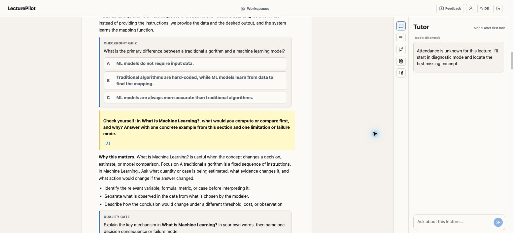

<div align="center">
  <h1>LecturePilot</h1>
  <p><strong>A lightweight, source-grounded course tutor for university teaching.</strong></p>
  <p>
    <a href="https://github.com/SebastianBoehler/lecture-pilot/actions/workflows/ci.yml">
      
    </a>
    
    
    
  </p>
</div>

LecturePilot turns private course material into a focused learning workspace.
Professors control the sources, schedule, and publication boundary. Students get
only authorized, already-unlocked lectures, with a tutor that can explain,
highlight, quiz, and create learner-owned notes without changing the official
course material.

The frontend never talks to model providers directly. Authentication, source
access, model routing, workspace tools, quotas, and audit events stay behind the
FastAPI backend. University of Tübingen integration is available through
[`tue-api-wrapper`](https://github.com/SebastianBoehler/tue-api-wrapper).

## Preview

<p align="center">
  
</p>

## Product flow

1. A professor imports a course folder. LecturePilot indexes every source and
   proposes where it belongs.
2. The professor reviews the routing and schedule, generates or repairs lecture
   canvases, and publishes them.
3. A student signs in and sees only enrolled, published lectures whose access
   date has passed.
4. The lesson opens as a source-backed canvas. Attendance changes the tutoring
   stance without changing the workspace schema.
5. The tutor leads checks, records evidence, and saves learner-specific progress,
   notes, preferences, and generated assets.
6. Exam Readiness and immutable practice exams provide separate, attempt-first
   ways to prepare and review solutions.

## What is included

- A React/Vite learning workspace with light and dark modes.
- A FastAPI policy and agent layer with Postgres-backed identity, sessions,
  enrollment evidence, course ownership, quotas, and audit events.
- Professor workflows for source routing, lecture ordering, draft generation and
  repair, exact-draft learning-design acknowledgement, publication, release
  notices, and learner-level aggregate insights.
- A constrained tutor that works through typed, capability-scoped tools over
  Markdown, YAML components, and learner assets. Backend policy—not the
  prompt—enforces tenant access, lecture unlocks, safe paths, and immutable
  official sources.
- Source-backed checkpoints, quizzes, Exam Readiness, practice exams, persistent
  learner memory, and in-canvas generated explanations or images.
- PDF-first slide previews plus an isolated, no-secret TeX compiler for courses
  that provide only source files.
- A credential-free local UI preview. Real tutor turns fail clearly until a
  supported provider key is configured.

## Small hosting footprint

LecturePilot is a CPU-only application control plane: model inference and image
generation run at the configured providers, so the host needs no model weights
or GPU. The checked-in Compose topology uses one shared host rather than a
container per learner.

| Workload             | Runtime boundary                | Checked-in limit                                 |
| -------------------- | ------------------------------- | ------------------------------------------------ |
| Web and HTTPS        | Static Nginx site behind Caddy  | No model compute                                 |
| API and agent tools  | FastAPI, shared by all learners | 2 vCPU, 2 GiB RAM, 256 processes                 |
| TeX preview compiler | Isolated internal worker        | 1 vCPU, 1 GiB RAM, 64 processes                  |
| State                | Postgres and named file volumes | Grows with accounts and uploaded course material |
| Model inference      | External provider API           | No local GPU or inference server                 |

Five long-running containers provide the gateway, web app, API, compiler, and
database. Preflight and migration are short-lived deployment jobs. On 2026-08-02,
the locally built production-shaped images reported about **1.2 GB in total** by
Docker's per-image sizes: API 490 MB, compiler 228 MB, Postgres 288 MB, gateway
105 MB, and web 64 MB. Shared layers mean actual Docker disk use is not the sum
of those figures.

The API and compiler limits are burst ceilings, not a measured host minimum; the
gateway, web, and database remain uncapped. The topology is intended for a
modest single-VM pilot, but cohort capacity and storage should be established
with representative uploads and traffic. See the
[self-hosting guide](docs/self-hosting.md) for deployment, backup, and open
production gates.

## Architecture

```txt
browser -> Caddy -> static web app
                 -> FastAPI policy + agent harness -> model/image providers
                                                    -> Postgres
                                                    -> persisted workspaces
                                                    -> isolated TeX compiler
```

The canvas is the editable learning surface. Official source material lives in
a course-owned workspace; generated notes, quiz components, progress, and
memory live in the learner workspace. See the
[workspace contract](docs/workspaces.md),
[agent tool contracts](docs/agent-tool-contracts.md), and
[course ingestion pipeline](docs/course-ingestion-pipeline.md) for the detailed
boundaries.

Professor adoption is supported by a persistent bilingual in-app walkthrough,
a repeatable 30-minute introduction, and the German/English recording checklist
in the [professor enablement guide](docs/professor-enablement.md).

The [evaluation contract](docs/evaluation-contract.md) defines the private
draft report, revision-bound outcome metadata, and the limits on future study
claims. These controls do not themselves establish learning efficacy or approve
a human study, ethics review, or production rollout.

## Local development

Requirements: Python 3.11+, Node.js with npm, and PostgreSQL.

```bash
npm install
python3 -m venv .venv
source .venv/bin/activate
pip install -e "apps/api[test,agent]"
cp .env.local.example .env.local
```

Add a provider key to `.env.local`, create and migrate the local databases named
in that file, then start the API and web app together:

```bash
alembic -c apps/api/alembic.ini upgrade head
npm run dev:demo
```

Open `http://127.0.0.1:5173` and select **Preview local demo**. Private course
material belongs in a gitignored root such as `local-course-materials/`; use
`LECTUREPILOT_COURSE_MATERIAL_ROOT` when the material lives elsewhere.

TeX-only previews also require the isolated compiler described in
[the LaTeX guide](docs/latex-compilation.md). Live University of Tübingen login
requires the optional integration:

```bash
pip install -e "apps/api[tuebingen]"
```

Local development reads only `.env.local`. Production reads only the ignored
`.env.production` created from `.env.production.example`; there is no generic
`.env` fallback. Provider selection and allowlisting remain server-side. See
the [self-hosting guide](docs/self-hosting.md) for the production Compose and
preflight sequence.

## Verification

Run the narrowest relevant check, or the full suite:

```bash
npm run verify:fast
npm run verify:api
npm run verify:web
npm run verify:full
```

`verify:api` and `verify:web` match the component checks used by CI. The full
API suite needs the migrated disposable test database from `.env.local.example`;
targeted unit tests do not all require Postgres. Provider benchmarks stay
outside CI because they make real, non-deterministic model calls.

## Documentation and status

The [documentation map](docs/README.md) points to current architecture,
security, operations, observability, and integration guidance while separating
dated design records. User-facing changes are maintained in
[`apps/web/src/productChangelog.json`](apps/web/src/productChangelog.json) and
rendered into [`CHANGELOG.md`](CHANGELOG.md).

LecturePilot has been deployed as a live pilot, but that is not blanket
production-security approval. Review the
[security status](security_best_practices_report.md) and
[operations runbook](docs/security-operations.md) before expanding access.
The 0.5.0 evaluation workflow was validated locally with synthetic data; it was
not itself a production deployment.

## License

Apache-2.0. See [LICENSE](LICENSE).
