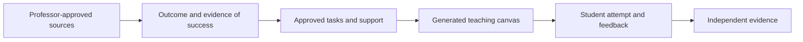

# Same learning goal, different paths, independent evidence

Presentation argument for Georg Martius, prepared 6 September 2026.
This extends the [learning-science brief](2026-09-04-learning-science-presentation-brief.md)
and [economics and scale](2026-09-06-presentation-economics.md).

## Recommended central framing

**The professor defines what students should be able to do. The AI helps each
student get there. The test is what the student can do independently afterward.**

Use three complementary frames, with the first as the main presentation:

| Frame                                       | Question it answers               | Concrete evidence to show                                                                          |
| ------------------------------------------- | --------------------------------- | -------------------------------------------------------------------------------------------------- |
| Professor-defined goals, adaptable teaching | Who controls educational quality? | Approved outcome, rubric, source and generated section together                                    |
| Assistance that leads to independence       | Did the student learn?            | Attempt, targeted support, changed unaided task; delayed evaluation as next experiment             |
| Affordable access across languages          | Who can use it?                   | Same conceptual objective with reviewed language variants, plus bounded cost and capacity evidence |

An optional engineering analogy is a curriculum compiler: an approved teaching
specification becomes a canvas and practice activities. Explain its limits:
schema checks cannot prove that teaching is correct or that a student learned.
The distinctive contribution is making instructional intent explicit and binding
generation to it. Do not claim to have invented objectives-first teaching.

## Objectives before the canvas

This is closely related to constructive alignment: specify intended outcomes,
then align teaching activities and assessment with them. Biggs describes this
explicitly in [Constructive alignment in university teaching](https://www.tru.ca/__shared/assets/Constructive_Alignment36087.pdf).
LecturePilot's engineering contribution is making this order an enforced workflow.

The current `PracticeTarget` contract has an observable outcome, invariant
reasoning operation, diagnostic task, independent-exit task and delayed-transfer
task. These fields express instructional intent; their existence does not certify
that every learner path has executed an independent or delayed assessment.
The native authoring instructions prohibit writing canonical checkpoints because
the server inserts professor-approved tasks.

Speaker line: “The canvas is an implementation of the learning goal. That lets
us change the explanation while keeping the intended capability explicit.”

## Learning science and neuroscience: mechanism before claims

Show a single evidence-to-design slide rather than a parade of brain images.
There is no universal best learning method independent of prior knowledge,
material and the outcome being assessed.

| Evidence                   | Mechanism or finding                                                                                    | Design implication                                          |
| -------------------------- | ------------------------------------------------------------------------------------------------------- | ----------------------------------------------------------- |
| Retrieval practice         | Producing an answer can strengthen later retrieval; recognition alone is a weaker success check         | Ask for explanation or application before revealing help    |
| Worked examples and fading | Novices can benefit from explicit guidance; later independent work tests whether support can be removed | Provide a useful step, then return a step to the student    |
| Spacing                    | Useful practice intervals depend on the retention interval                                              | Revisit knowledge over time and measure delayed performance |
| Feedback                   | The content and instructional role of feedback matter                                                   | Address a reasoning gap and elicit another attempt          |

The existing brief supplies the worked-example, spacing and transfer research.
For neuroscience, Wiklund-Hörnqvist et al. studied word-pair learning with fMRI
and a test one week later. Prior retrieval practice was associated with different
hippocampal responses during delayed recall. This provides a mechanistic bridge;
it does not establish that LecturePilot changes these brain processes or improves
conceptual transfer. [Study abstract and figures](https://pubmed.ncbi.nlm.nih.gov/33094555/).

Local neuroscience connection: Tübingen's Jan Born research group studies learning,
memory and sleep. It provides a relevant research context for memory consolidation,
not an endorsement or an optimal review schedule for our system.
[Official group description](https://uni-tuebingen.de/en/278832).
For a concrete local experiment, Himmer et al. (2019), including Tübingen
researchers, used fMRI and found that sleep stabilized rehearsal-related changes
in memory-system recruitment in their task. This motivates looking beyond the
immediate practice session; it does not prescribe a LecturePilot schedule.
[Primary study](https://pubmed.ncbi.nlm.nih.gov/31032406/).
Use neuroscience to explain why later memory matters, and behavioral experiments
to evaluate whether this teaching intervention actually works. No sensors are needed
to test the initial learning hypothesis.

## Tübingen and the mixed AI-tutoring evidence

Wagner et al. (2024) studied feedback and instruction in three physics-learning
experiments. TüCeDE's own report emphasizes that feedback formulation strongly
affects learning success. This directly motivates examining what a tutor says
after an attempt, beyond a correct/incorrect label.
[University report and paper citation](https://uni-tuebingen.de/forschung/zentren-und-institute/tuebingen-center-for-digital-education/newsfullview-tuecede/article/the-more-the-better/).
The publisher full text was unavailable in this pass; detailed experiment-level
claims remain in the earlier sourced brief, rather than being reverified here.

Use two contrasting external results to make the research problem concrete:

- Bastani et al.: unrestricted AI assistance improved practice performance but
  reduced subsequent unaided exam grades in that high-school study. Guarded
  tutoring mitigated the harm but did not establish a positive unaided effect.
  [Author manuscript](https://hamsabastani.github.io/education_llm.pdf).
- Kestin et al.: a designed university physics tutor produced greater learning
  in less time than the active-learning comparison in that trial.
  [Published abstract](https://pubmed.ncbi.nlm.nih.gov/40537565/).
  Full publisher text was inaccessible in this pass; avoid extra numerical claims.

Different populations, designs and tests prevent treating these as a model ranking.
The useful inference is that instructional design and the outcome measure matter.
Neither trial establishes LecturePilot's effectiveness.

## Language as an adaptable teaching surface

For many conceptual subjects, the target capability can remain stable across
languages. It is not universally language-independent: language courses,
terminology-sensitive professional tasks and language-specific examinations are
counterexamples. Even in mathematics, translated assessment difficulty needs review.

Illustrative ML objective, not an added or approved course task:

> Given training and validation error curves, identify evidence of overfitting
> and justify the diagnosis using their divergence.

| Explanation language       | Example expression of the same intended capability                                                                     |
| -------------------------- | ---------------------------------------------------------------------------------------------------------------------- |
| English                    | Diagnose overfitting from training and validation error curves and justify your conclusion.                            |
| German                     | Erkenne Overfitting anhand von Trainings- und Validierungsfehlerkurven und begründe deine Diagnose.                    |
| French, proposed extension | Repérer le surapprentissage à partir des courbes d’erreur d’entraînement et de validation, et justifier le diagnostic. |

Preserve the concept, evidence requirements, rubric and difficulty; adapt the
language, phrasing and explanation. A bilingual glossary can bridge to the
examination language. This is an instructional proposal, not a measured benefit.

Actual implementation inspected today: `Course.canvas_language` allows German
and English. Authoring receives the output language, and authoring state binds it.
The language helper permits multilingual source evidence while retaining formulas,
identifiers and citations. French is not currently a supported course-language
value. No instant per-student language-switching workflow was demonstrated.

Additional language sources belong in the authorized shared course workspace,
followed by source indexing, semantic routing and professor confirmation. Merely
placing files in a Docker container does not establish their authority or
equivalence. New source revisions invalidate affected approvals. Source duplication
is not required solely to translate teaching from an already-approved source.

Canonical approved tasks must not be silently translated by the authoring agent.
Reviewed language variants need explicit revision/provenance treatment, and student
assessment must still measure the intended concept rather than language fluency.
Do not infer multilingual equivalence from a successful translation request.

## Presentation demonstration and next experiment

Show the approved objective next to its rubric and the generated section. Make
one learner error and show targeted assistance. End the demo by identifying the
changed unaided task that would test whether the learner owns the reasoning.
For language, use an explicitly labeled concept illustration or a separately
rehearsed supported-language example; do not promise an untested live language toggle.

Proposed study: compare the guided workflow with equal-content, equal-time
ordinary study resources, with prior knowledge measured and independent scoring
of a delayed changed-form task. Record assistance and instructor review effort.
Treat multilingual adaptation as a separate question: assess conceptual learning
and exam-language performance, stratifying by language proficiency. A small
pilot can test feasibility; it cannot establish translation equivalence without
an appropriate design and precision target.

Close with a conditional prediction: “As acceptable assistance becomes cheaper,
the scarce resource may shift toward defining worthwhile learning goals and
verifying independent learning. LecturePilot makes that relationship explicit.”
